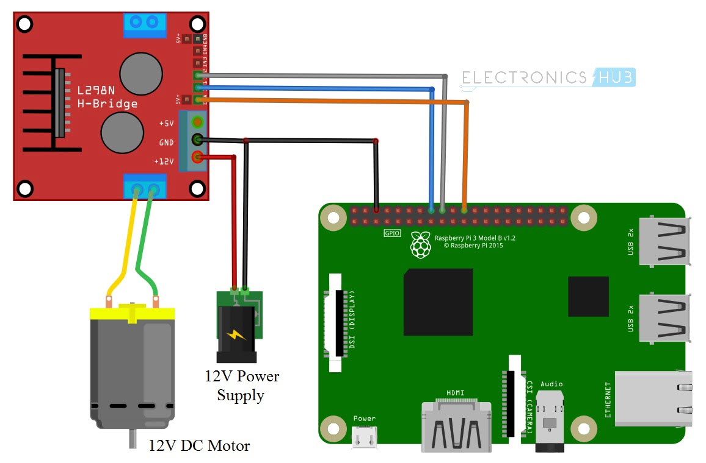

<h2>  Unmanned Ground Vehicle (UGV)</h2>

Wirelessly controlled robot that provides live video footage

Author: Samuel Rodriguez (<a href="mailto:samuelrprofessional@gmail.com">samuelrprofessional@gmail.com</a>)

Started: 06/01/21

Last Updated: 06/13/21

Self-Link: <a href="https://tinyurl.com/k3rpch2p">https://tinyurl.com/k3rpch2p</a>

<h2>Background</h2>

Personally, I am at my university for most of the year, so I do not have the ability to traverse around my house to see my dogs, and I tend to get homesick sometimes.

<h3>Problem</h3>

Humans are limited in how fast they can travel. It is not instant, nor do we have the financial means to travel all the time. We are also limited such that we cannot be in multiple places at the same time either.

<h3>Objective/Solution</h3>

<ul>

<li>Build a wirelessly controlled robot from anywhere in the world

<li>Install camera to get live video footage from robot

<li>Control robot from a secure site

<li>Robot travels on the ground
</li>
</ul>
<h3>Materials</h3>

<ul>

<li>Raspberry Pi 4 Model B : $43

<li>Micro HDMI to HDMI cable : $0 (Already have)

<li>16BG Micro SD card (x3) : $9.90

<li>5V DC 3A power supply adapter with USB type C : $0 (Already have)

<li>4 Wheels and 4 motors : $14.99

<li>L298N Motor Drive Controller Board DC Dual H-Bridge Robot Stepper Motor Control and dupont cables : $ 6.99

<li>Female to female wiring: $5.99
</li>
</ul>

Total Cost: 43 + 0 + 9.90 + 0 + 14.99 + 6.99 + 5.99 = 80.87

<h2>Mock Up</h2>

Website where user controls robot from and views live video

<h2>Technologies</h2>

<h5>Figma</h5>

<ul>

<li>Design website mockup that will serve as the remote control for the UGV

<li>Provide assets from the mockup into the actual website
</li>
</ul>
<h5>Python</h5>

<ul>

<li>Use GPIOZero module to control motors:
</li>
</ul>

<a href="https://gpiozero.readthedocs.io/en/stable/api_output.html?highlight=motor#motor">https://gpiozero.readthedocs.io/en/stable/api_output.html?highlight=motor#motor</a>

<h5>Django</h5>

<ul>

<li>Create Django development server to communicate between Pi and remote control device

<li>Javascript listeners performs GET request when user presses specific keys that are mapped to various robot configurations (i.e. arrow keys to move)

<li>Executes python script to handle GET and POST requests while simultaneously controlling Pi via GPIO output signals
</li>
</ul>
<h5>Ngrok</h5>

<ul>

<li>Features a secure tunneling service to connect any device to Pi from anywhere in the world online

<li>Implements SSH online to activate server on the Pi and control the robot all from a device like a laptop
</li>
</ul>
<h5>HTML</h5>

<ul>

<li>Basic website design (refer to mockup) that will show controls and live video
</li>
</ul>
<h5>DC Motors</h5>

<ul>

<li>Gives all 4 wheel drive mobility

<li>Activates each motor according to input from Raspberry Pi

<li>Level of voltage correlates with rpm

<li>One motor per wheel

<li>Two motors per motor controller
</li>
</ul>
<h5>Raspberry Pi</h5>

<ul>

<li>Hub for robot

<li>Communicates with server 
<ul>
 
<li>Receives input for how to control UGV
 
<li>Sends live video output
</li> 
</ul>

<li>Sends output to motors to move UGV

<li>Receives input from camera to send live video
</li>
</ul>
<h5>Camera</h5>

<ul>

<li>Connects to Raspberry Pi

<li>Sends video data to Raspberry Pi
</li>
</ul>
<h5>Electric Wire Diagram for One TT Motor</h5>

<h5>L298N Motor Drive Controller</h5>

<ul>

<li>Communicate between 2 motors and Pi

<li>Controls voltage delivered to the motors to change motor’s RPM (essentially controlling speed of the robot)
</li>
</ul>
<h2>Solution/Description</h2>

TODO: Write down each piece of the solution, i.e. break it down into smaller pieces

<h3>Who will do what?</h3>

I, Samuel Rodriguez, will be doing all of the work

<h3>When will it be done?</h3>

<h4>Week 1</h4>

<ul>

<li>Order all materials to practice with Raspberry Pi without constructing robot

<li>Create website mockup on Figma

<li>Finish design doc

<li>Create static web page following mockup
</li>
</ul>
<h4>Week 2</h4>

<ul>

<li>Connect to Raspberry Pi to control via laptop’s monitor and keyboard

<li>Create local http-server with Python

<li>Connect motors to power source to test that they are running
</li>
</ul>
<h4>Week 3</h4>

<ul>

<li>Configure motor drive controller to Pi and motors

<li>Send local signals to Pi to control motors via Pi

<li>Configure camera to Pi (might need camera module)
</li>
</ul>
<h4>Week 4</h4>

<ul>

<li>Configure camera to Pi

<li>Create client for Pi to connect to http-server (with Python)

<li>Control Pi via server (ensure connection even on different networks).
</li>
</ul>
<h4>Week 5</h4>

<ul>

<li>Build robot skeleton and mount all devices
</li>
</ul>
<h4>Week 6</h4>

<h2>Weekly Log</h2>

<h4>Week 1</h4>

<ul>

<li>I bought Raspberry Pi, motors, wheels, motor driver controller, few wires, and Micro SD cards

<li>Research how to setup Raspberry Pi via guidebook 

<li>Construct GitHub Repo

<li>Wrote some technologies in design doc

<li>Create website mockup

<li>Implement website (control center) skeleton
</li>
</ul>
<h4>Week 2</h4>

<ul>

<li>Set Up and Connected Raspberry Pi to VNC and SSH 
<ul>
 
<li>Enables Pi to be controlled from laptop
</li> 
</ul>

<li>Create django project in development mode and integrated control center site

<li>Integrated GPIO control in django development project

<li>Connected motors to the power source via reconfigured USB cable and they worked!

<li>Purchased female to female wiring
</li>
</ul>
<h4>Week 3</h4>
<ul>
<li> Cut out bottom chasis from clipboard
<li> Attached motors, Pi, Pi power source, motor drive controller, and motor driver controller
power source to chasis
<li> Performed initial tests controlling robot prototype from a local
<li> Necessary improvements: distribute weight evenly on robot as power sources
are the main source of weight that is fastened to only one side of the robot.
</ul>

<h4>Week 4</h4>

<h4>Week 5</h4>

<h4>Week 6</h4>

<h2>Conclusion</h2>

